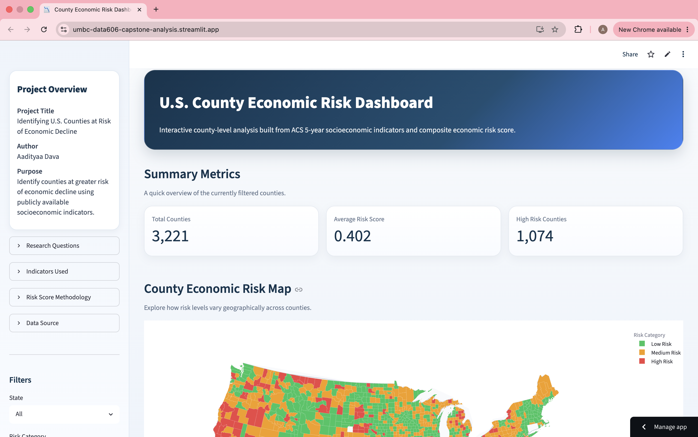
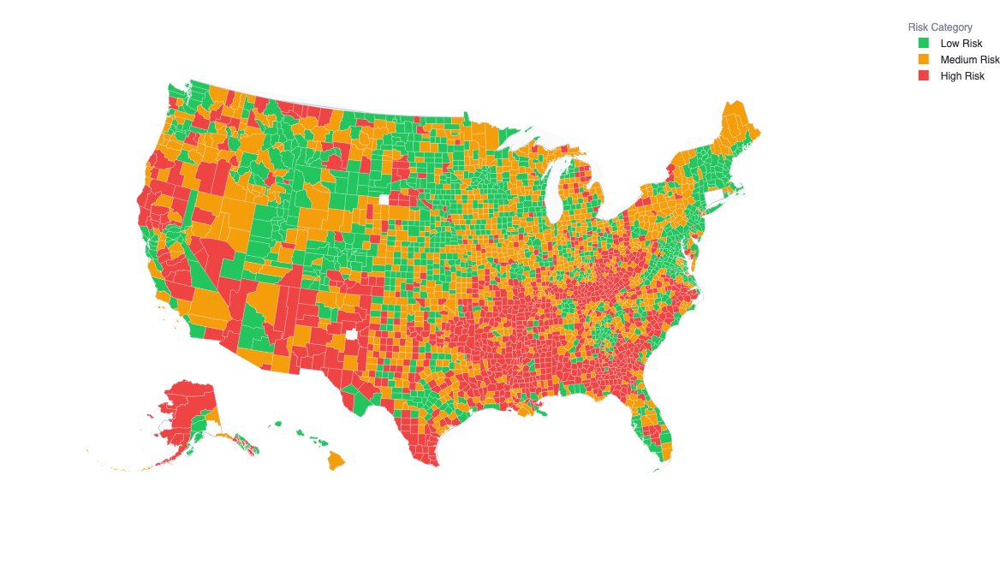

# Identifying U.S. Counties at Risk of Economic Decline Using Public Socioeconomic Indicators

## Project Overview

Economic decline is a complex challenge influenced by multiple socioeconomic factors including income levels, poverty, employment opportunities, educational attainment, and housing stability.

This project develops a county-level economic risk assessment framework using publicly available socioeconomic data from the U.S. Census Bureau's American Community Survey (ACS) 5-Year Estimates. The solution combines data engineering, exploratory data analysis, economic risk modeling, and interactive dashboard development to identify counties potentially vulnerable to economic decline.

The project demonstrates how public socioeconomic indicators can be transformed into actionable insights for regional planning, economic development, policy evaluation, and community support initiatives.

---

## Business Problem

Economic conditions vary significantly across U.S. counties, making it difficult for policymakers, researchers, and community organizations to identify areas that may require targeted intervention.

Traditional economic analysis often focuses on individual indicators, making it challenging to obtain a holistic view of regional economic vulnerability.

The objectives of this project are to:

* Analyze county-level socioeconomic conditions across the United States
* Identify counties potentially vulnerable to economic decline
* Develop an interpretable economic risk scoring framework
* Categorize counties into risk segments
* Visualize economic disparities through interactive dashboards
* Support data-driven economic planning and decision-making

---

## Technology Stack

### Programming & Analytics

* Python
* Pandas
* NumPy

### Data Visualization

* Plotly
* Matplotlib
* Streamlit

### Modeling & Analytics

* Scikit-Learn
* Statistical Analysis
* Composite Risk Scoring

### Development Environment

* Jupyter Notebook
* Git
* GitHub

---

## Project Architecture

```text
ACS Census Data
        ↓
Data Cleaning & Preprocessing
        ↓
Feature Engineering
        ↓
Exploratory Data Analysis
        ↓
Economic Risk Scoring
        ↓
County Risk Segmentation
        ↓
Interactive Streamlit Dashboard
```

---

## Dataset

The project utilizes county-level socioeconomic indicators obtained from the U.S. Census Bureau's American Community Survey (ACS) 5-Year Estimates.

### ACS Tables Used

| Dataset | Description             |
| ------- | ----------------------- |
| B01003  | Total Population        |
| B15003  | Educational Attainment  |
| B17001  | Poverty Status          |
| B19013  | Median Household Income |
| B23025  | Employment Status       |
| B25003  | Housing Tenure          |

### Final Dataset

The processed dataset contains:

* 3,221 U.S. Counties
* Multiple socioeconomic indicators
* Composite Economic Risk Score
* Risk Category Classification

---

## Project Workflow

### Notebook 01 – Data Cleaning & Preprocessing

* Loaded multiple ACS datasets
* Standardized variables and formats
* Handled missing values
* Merged datasets using county FIPS codes
* Created county-level analytical dataset

### Notebook 02 – Exploratory Data Analysis

* Descriptive statistics
* Distribution analysis
* Correlation analysis
* Socioeconomic trend exploration
* Interactive visualizations

### Notebook 03 – Economic Risk Modeling & Validation

* Developed composite economic risk score
* Combined multiple socioeconomic indicators
* Risk segmentation framework
* Validation of scoring methodology
* County risk categorization

### Notebook 04 – Dashboard Development

* Prepared dashboard-ready datasets
* Built interactive visualizations
* Created geographic risk mapping
* Streamlit dashboard integration

---

## Economic Risk Framework

The economic risk score was developed using multiple socioeconomic indicators:

### Income Indicators

* Median Household Income

### Poverty Indicators

* Poverty Rate

### Employment Indicators

* Unemployment Rate

### Education Indicators

* Bachelor's Degree Attainment

### Housing Indicators

* Homeownership Rate

Counties were categorized into:

| Category    | Description                       |
| ----------- | --------------------------------- |
| Low Risk    | Strong socioeconomic conditions   |
| Medium Risk | Moderate economic vulnerability   |
| High Risk   | Elevated risk of economic decline |

---

## Key Findings

The analysis revealed that counties exhibiting the following characteristics were more likely to fall into higher-risk categories:

* Higher poverty rates
* Higher unemployment levels
* Lower median household income
* Lower educational attainment
* Lower homeownership rates

Economic risk patterns demonstrated substantial geographic variation across the United States, highlighting significant regional disparities in socioeconomic conditions.

---

## Streamlit Dashboard

An interactive Streamlit dashboard was developed to support county-level economic analysis and visualization.

### Dashboard Features

#### Executive Overview

Provides:

* Total Counties Analyzed
* Average Economic Risk Score
* High-Risk County Count
* Risk Distribution Summary

#### County Economic Risk Map

Provides:

* Geographic risk visualization
* County-level risk analysis
* Regional comparisons
* Interactive exploration

#### Socioeconomic Analysis

Provides:

* Income analysis
* Poverty analysis
* Employment analysis
* Education analysis
* Housing analysis

---

## Dashboard Screenshots

### Dashboard Overview



### County Risk Map



---

## Live Dashboard

Streamlit Application:

https://umbc-data606-capstone-analysis.streamlit.app

---

## Project Structure

```text
U.S._County_Economic_Risk_Analysis_and_Decline_Assessment/

├── app/
│   ├── app.py
│   └── README.md
│
├── data/
│   ├── ACSDT5Y2024.B01003-Data.csv
│   ├── ACSDT5Y2024.B15003-Data.csv
│   ├── ACSDT5Y2024.B17001-Data.csv
│   ├── ACSDT5Y2024.B19013-Data.csv
│   ├── ACSDT5Y2024.B23025-Data.csv
│   ├── ACSDT5Y2024.B25003-Data.csv
│   ├── county_master.csv
│   ├── county_risk_app_ready.csv
│   └── README.md
│
├── docs/
│   ├── final_presentation.pdf
│   ├── project_report.md
│   └── README.md
│
├── notebooks/
│   ├── 01_cleaning_preprocessing.ipynb
│   ├── 02_eda_economic_risk.ipynb
│   ├── 03_economic_risk_modeling_and_validation.ipynb
│   ├── 04_visualization_streamlit.ipynb
│   └── README.md
│
├── reports/
│   ├── dashboard_overview.png
│   └── county_risk_map.png
│
├── requirements.txt
└── README.md
```

---

## Business Impact

This project demonstrates how publicly available socioeconomic data can be leveraged to:

* Identify economically vulnerable counties
* Support regional economic planning
* Inform public policy decisions
* Enable data-driven resource allocation
* Improve understanding of socioeconomic disparities
* Support community development initiatives

---

## Future Improvements

Potential enhancements include:

* Time-series economic trend analysis
* Advanced machine learning models
* Additional Census datasets
* Economic forecasting capabilities
* Enhanced geographic visualizations
* Cloud deployment and automated updates

---

## Author

**Aadityaa Dava**

Data Analytics | Business Intelligence | Machine Learning

University of Maryland, Baltimore County (UMBC)
